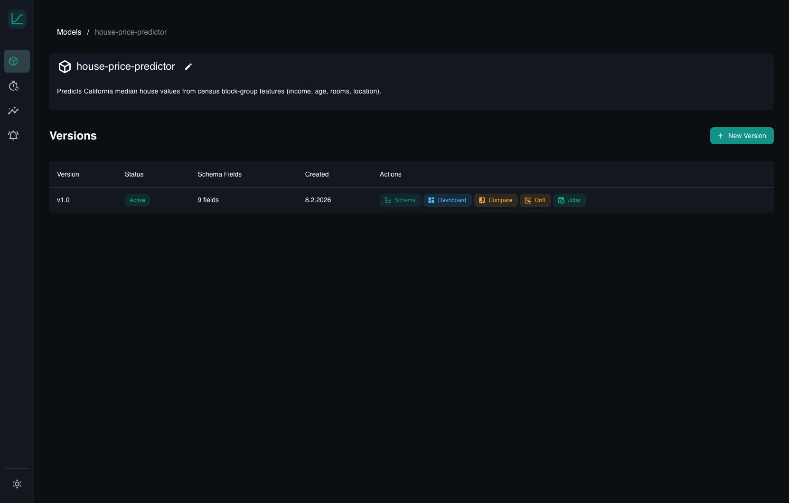
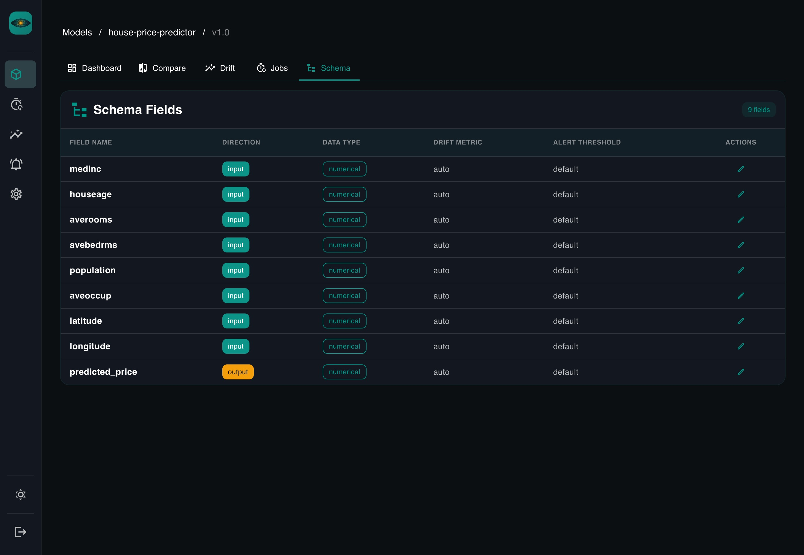
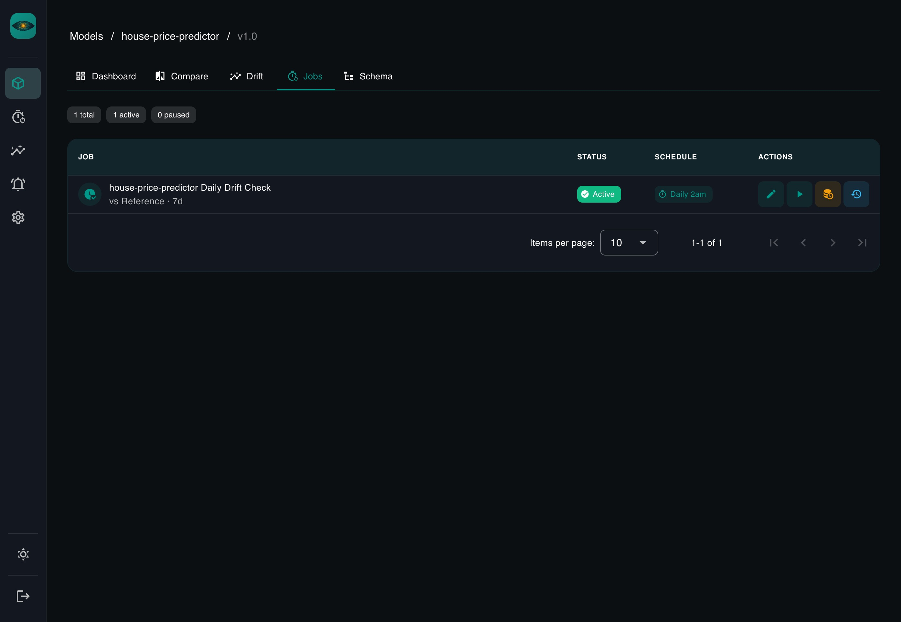

# YAAI Monitoring — Documentation

## Overview

YAAI Monitoring (Yet Another AI Monitoring) is a self-hosted platform for automated ML model monitoring. It differentiates from existing tools by being **schema-driven** — you define your model's input/output schema once, and dashboards, drift detection, and alerting are generated automatically.

## Screenshots

### Models Overview

### Model Versions

### Version Dashboard

### Schema Definition

### Data Comparison

### Drift Overview

### Drift Dashboard

### Scheduled Jobs

### All Jobs Overview

## Documentation Index

### Project

- [Vision & Goals](vision.md) — project scope, differentiators, non-goals

### Architecture

- [Architecture Overview](architecture.md) — system design, tech stack, component layout
- [Data Model](data-model.md) — database schemas, entity relationships, storage strategy
- [API Design](api-design.md) — REST endpoints, request/response schemas
- [Frontend](frontend.md) — pages, components, auto-dashboard rendering

### Guides

- [Drift Guide](drift-guide.md) — how drift metrics work (PSI, KS, Chi-squared, JSD), handling non-tabular models

### Feature Specifications

- [Model Management](features/model-management.md) — model & version CRUD, schema definition
- [Inference Tracking](features/inference-tracking.md) — data ingestion, validation, storage
- [Auto Dashboard](features/auto-dashboard.md) — schema-to-chart generation, layout rules
- [Data Comparison](features/data-comparison.md) — time-window & reference comparisons
- [Drift Detection](features/drift-detection.md) — metrics, thresholds, alerting
- [Job Scheduling](features/job-scheduling.md) — cron jobs, run history, result storage

### Decisions

Architecture Decision Records (ADRs) document key technical choices.

- [ADR-001: Tech Stack](decisions/001-tech-stack.md)
