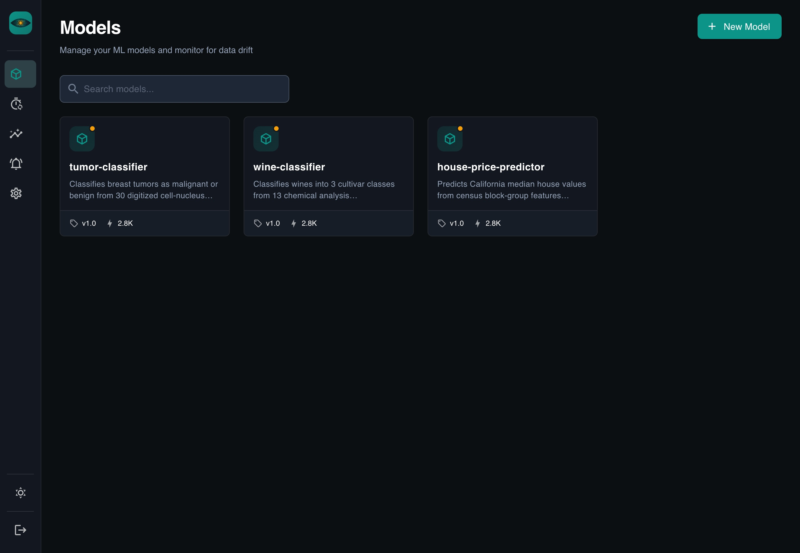
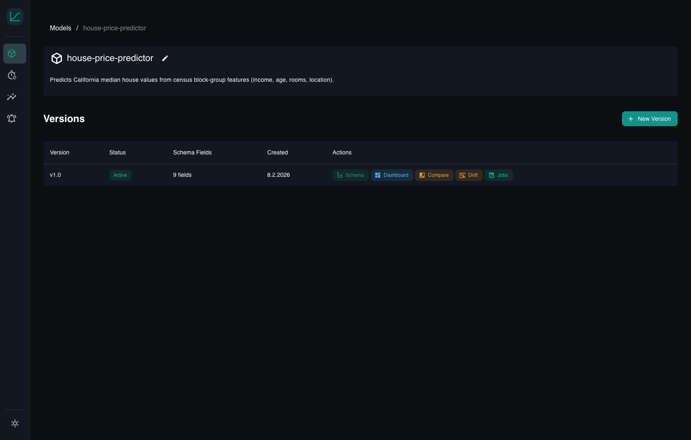
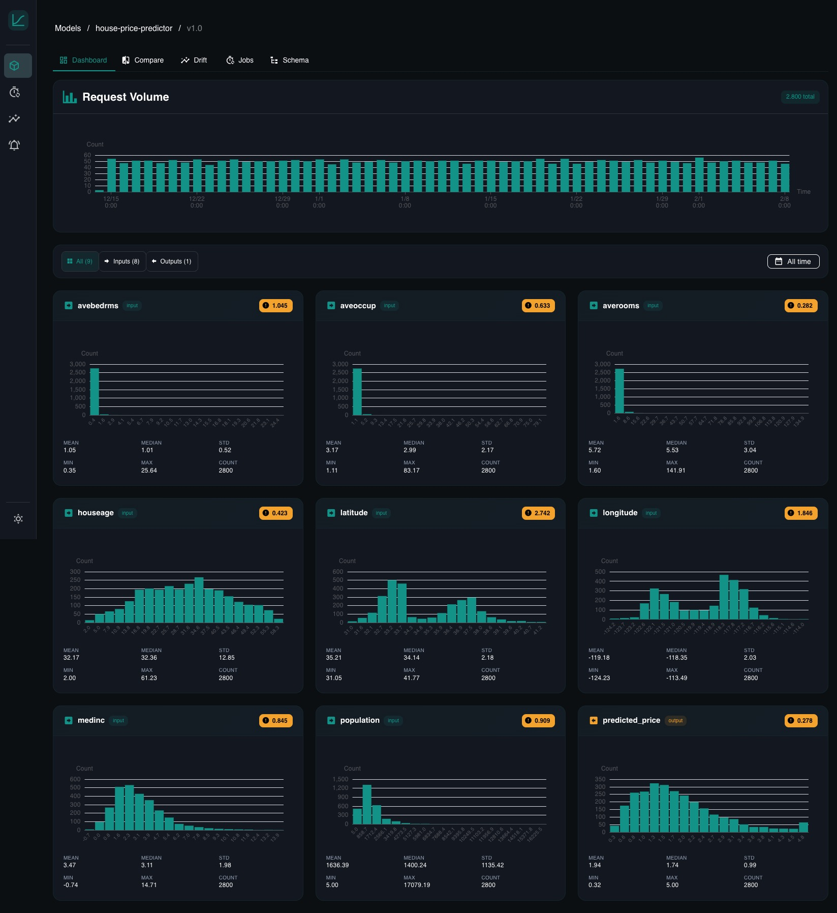
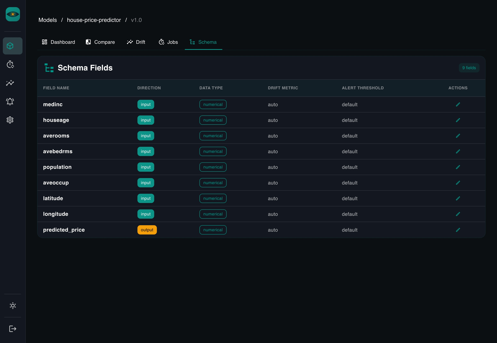
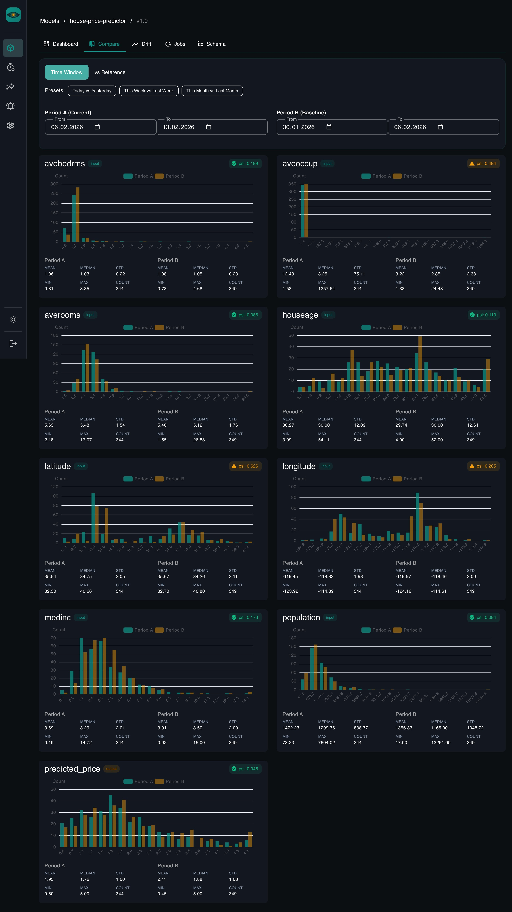
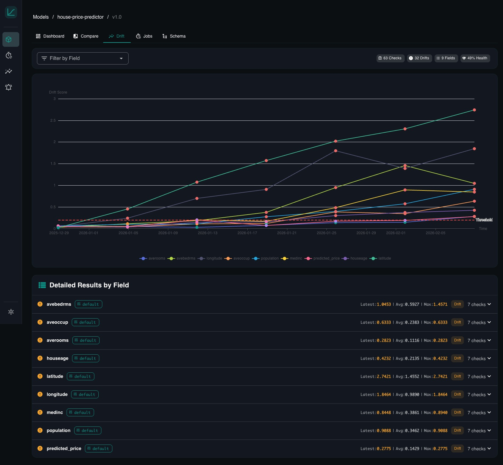
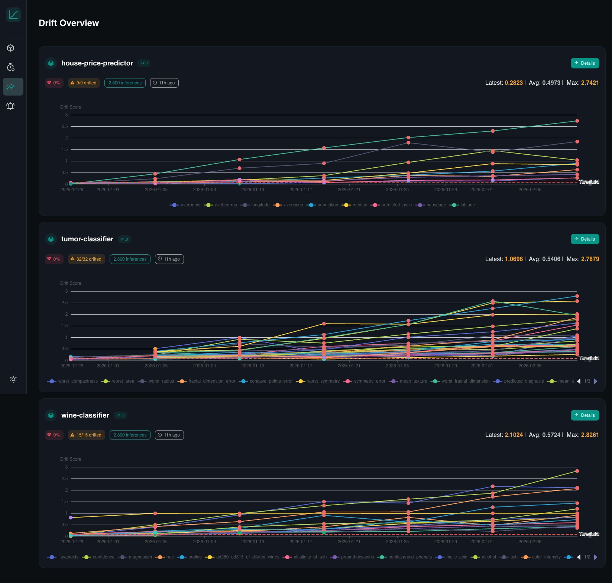
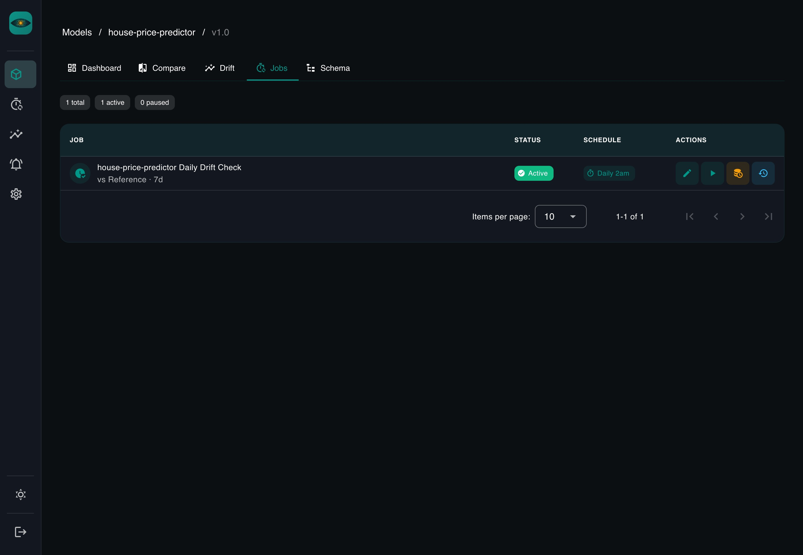
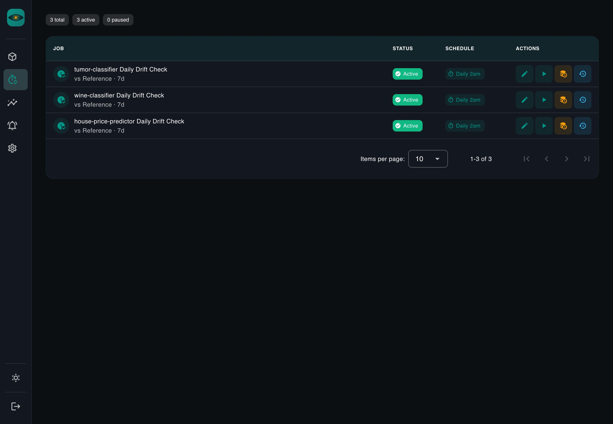

# YAAI Monitoring — Documentation

## Overview

YAAI Monitoring (Yet Another AI Monitoring) is a self-hosted platform for automated ML model monitoring. It differentiates from existing tools by being **schema-driven** — you define your model's input/output schema once, and dashboards, drift detection, and alerting are generated automatically.

## Screenshots

### Models Overview

### Model Versions

### Version Dashboard

### Schema Definition

### Data Comparison

### Drift Overview

### Drift Dashboard

### Scheduled Jobs

### All Jobs Overview

## Documentation Index

### Architecture

- [Architecture Overview](architecture.md) — system design, tech stack, component layout

### Guides

- [Getting Started](getting-started.md) — quick start guide
- [Server Setup](server-setup.md) — local development setup
- [Deployment](deployment.md) — production deployment
- [Configuration](configuration.md) — environment variables and settings
- [Concepts](concepts.md) — models, versions, schemas, drift detection
- [Drift Guide](drift-guide.md) — how drift metrics work (PSI, KS, Chi-squared, JSD), handling non-tabular models

### Reference

- [API Reference](reference/api.md) — REST API (OpenAPI / Swagger)
- [SDK Reference](reference/sdk.md) — Python client library
