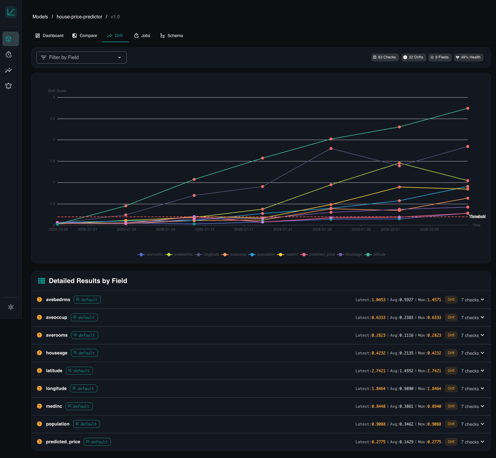
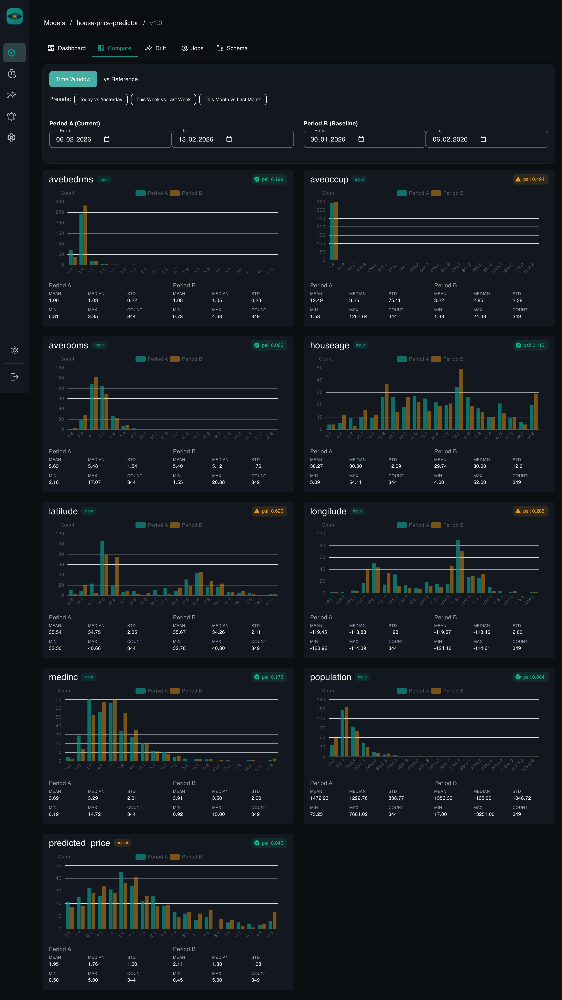

# Getting Started

This walks you through the full flow: start the server, register a model, send data, and watch dashboards appear.

## Installation

YAAI ships as two things: a lightweight **Python SDK** and a self-hosted **monitoring server**.

```bash
pip install yaai-monitoring              # SDK only (httpx + pydantic)
pip install "yaai-monitoring[server]"    # Full server
pip install "yaai-monitoring[server,gcp]" # Server + Google Cloud support
```

## Start the server

The fastest path is Docker Compose:

```bash
git clone https://github.com/Maxl94/yaai.git
cd yaai
cp .env.example .env
docker compose up -d
```

This starts PostgreSQL and the YAAI server. Open [http://localhost:8000](http://localhost:8000) -- you should see the login screen.

Default login: `admin` / check the server logs for the generated password.

> [!TIP]
> For step-by-step server configuration, environment variables, and authentication setup, see:
>
> - **[Server Setup](server-setup.md)** -- local development with PostgreSQL, env vars, auth options
> - **[Deployment](deployment.md)** -- production setup with Docker Compose, Google Cloud SQL

## Option A: Use the Python SDK

Install the SDK (just `httpx` + `pydantic`, nothing heavy):

```bash
pip install yaai-monitoring
```

Then run this script. It registers a model, defines a schema, uploads reference data, and sends inference data -- everything you need for dashboards and drift detection to kick in.

```python
import asyncio
from yaai import YaaiClient
from yaai.schemas.model import SchemaFieldCreate

async def main():
    async with YaaiClient("http://localhost:8000/api/v1", api_key="yaam_...") as client:

        # 1. Register a model
        model = await client.create_model(
            "churn-predictor",
            description="Predicts whether a customer will churn",
        )

        # 2. Create a version with its schema
        #    This tells YAAI what your model's inputs and outputs look like.
        #    Dashboards, drift metrics, and validation are derived from this.
        version = await client.create_model_version(
            model_id=model.id,
            version="v1.0",
            schema_fields=[
                SchemaFieldCreate(field_name="age", direction="input", data_type="numerical"),
                SchemaFieldCreate(field_name="income", direction="input", data_type="numerical"),
                SchemaFieldCreate(field_name="region", direction="input", data_type="categorical"),
                SchemaFieldCreate(field_name="churn_prob", direction="output", data_type="numerical"),
            ],
        )

        # 3. Upload reference data (your training distribution)
        #    This is the baseline that drift detection compares against.
        import random
        reference = [
            {
                "inputs": {
                    "age": random.gauss(35, 8),
                    "income": random.gauss(65000, 15000),
                    "region": random.choice(["west", "central", "east"]),
                },
                "outputs": {"churn_prob": random.random()},
            }
            for _ in range(500)
        ]
        await client.add_reference_data(model.id, version.id, reference)

        # 4. Send inference data (what your model sees in production)
        inferences = [
            {
                "inputs": {
                    "age": random.gauss(38, 10),  # slightly shifted
                    "income": random.gauss(62000, 14000),
                    "region": random.choice(["west", "central", "east", "south"]),
                },
                "outputs": {"churn_prob": random.random()},
            }
            for _ in range(200)
        ]
        await client.add_inferences(version.id, inferences)

        print(f"Done. Open http://localhost:8000 and navigate to {model.name}.")

asyncio.run(main())
```

## Option B: Use the REST API directly

No SDK needed. Plain HTTP works just as well:

```bash
API_KEY="yaam_..."
BASE="http://localhost:8000/api/v1"

# 1. Create a model
MODEL=$(curl -s -X POST "$BASE/models" \
  -H "Content-Type: application/json" \
  -H "X-API-Key: $API_KEY" \
  -d '{"name": "churn-predictor"}')

MODEL_ID=$(echo $MODEL | python3 -c "import sys,json; print(json.load(sys.stdin)['data']['id'])")

# 2. Create a version with schema
VERSION=$(curl -s -X POST "$BASE/models/$MODEL_ID/versions" \
  -H "Content-Type: application/json" \
  -H "X-API-Key: $API_KEY" \
  -d '{
    "version": "v1.0",
    "schema": [
      {"field_name": "age", "direction": "input", "data_type": "numerical"},
      {"field_name": "income", "direction": "input", "data_type": "numerical"},
      {"field_name": "region", "direction": "input", "data_type": "categorical"},
      {"field_name": "churn_prob", "direction": "output", "data_type": "numerical"}
    ]
  }')

VERSION_ID=$(echo $VERSION | python3 -c "import sys,json; print(json.load(sys.stdin)['data']['id'])")

# 3. Send inference data
curl -s -X POST "$BASE/inferences" \
  -H "Content-Type: application/json" \
  -H "X-API-Key: $API_KEY" \
  -d "{
    \"model_version_id\": \"$VERSION_ID\",
    \"inputs\": {\"age\": 42, \"income\": 71000, \"region\": \"west\"},
    \"outputs\": {\"churn_prob\": 0.73}
  }"
```

## What happens next

Once data starts flowing, open [http://localhost:8000](http://localhost:8000) and click into your model:

**Dashboards** -- for every field in your schema, YAAI generates a chart automatically. Numerical fields get histograms with summary stats. Categorical fields get bar charts. No configuration needed.


**Drift detection** -- when you created the model version, YAAI set up a default drift job (daily at 2am, comparing recent data against your reference data). It starts running as soon as reference data exists. You can also trigger it manually or change the schedule.



**Comparisons** -- pick any two time ranges and compare distributions side by side. Overlaid histograms for numerical features, grouped bar charts for categorical ones. PSI / KS / Chi-squared scores computed inline.



## What to explore next

- [Core Concepts](concepts.md) -- understand models, versions, schemas, and how drift detection works
- [Drift Detection Guide](drift-guide.md) -- deep dive into PSI, KS test, Chi-squared, and Jensen-Shannon divergence with visual explanations
- [REST API Reference](reference/api.md) -- the full OpenAPI spec
- [Python SDK Reference](reference/sdk.md) -- all client methods with type signatures
